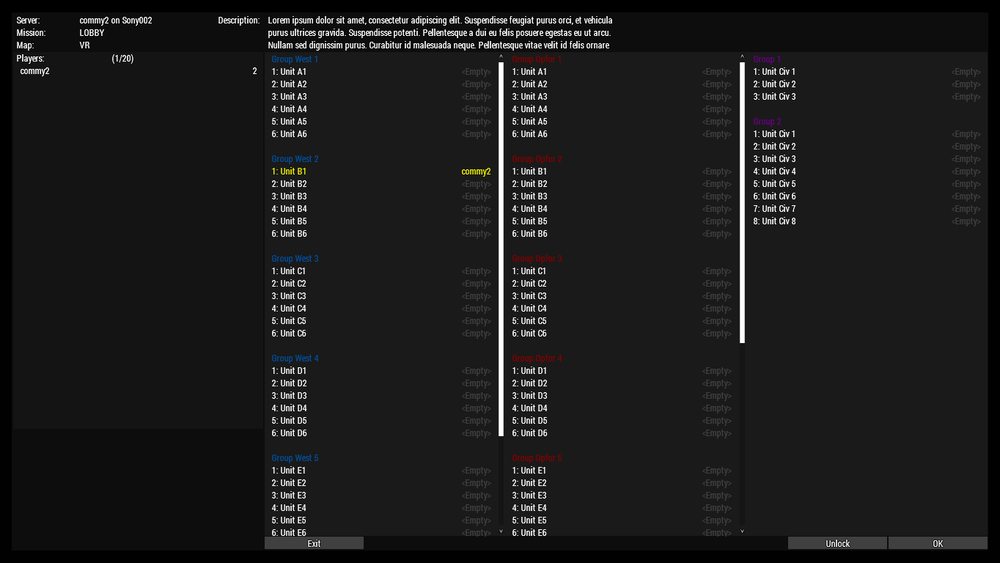

# Arma-3-Scripted-Lobby

### Screenshot


### Usage
Lobby groups are created using `Lobby_fnc_createGroup`. Lobby Slots are created using `Lobby_fnc_createSlot`. `Lobby_fnc_deleteGroup` and `Lobby_fnc_deleteSlot` are used to delete them. Groups and Slots can be created or deleted during the mission, but the functions have to be executed on every machine (they have "Local Effects").

Examples can be found in this missions `init.sqf` file. It should be self explanatory.

The mission will need dummy slots for players to be able to connect to the server. These are themselves unplayable entities with no model and disabled simulation. If the server is supposed to support 100 players, 100 of these will have to be created. To make this process as easy as possible, you can execute:
```sqf
100 execVM "setup.sqf"
```
in the Eden-Editor from the Debug Console, and save and export the mission.
In this example, 100 is the total number of playable slots you wish to have in your mission.

### Potential Issues
- Scripts like `initPlayerLocal.sqf`, `initPlayerServer.sqf`, `waitUntil {!isNull player};` loops in `init.sqf` etc. will probably have to be replaced by the init script defined in `Lobby_fnc_createSlot` to point to the correct player object.

### Remotely Executed Functions
These functions have to be whitelisted in `CfgRemoteExec`:
- Lobby_fnc_slotIn
- Lobby_fnc_slotOut
- Lobby_fnc_setIdentity

If you don't use `CfgRemoteExec`, you don't need to whitelist them.

### Setup Dev Environment
Open `cmd.exe` and execute:
```bat
mklink /d "%UserProfile%\Documents\Arma 3 - Other Profiles\<ARMA-PROFILE-NAME>\missions\LOBBY.VR" "<PATH-TO-PROJECT-FOLDER>\missions\LOBBY.VR"
```
where `<ARMA-PROFILE-NAME>` is your active user profile name, e.g. `commy2`, and `<PATH-TO-PROJECT-FOLDER>` is the path to the folder containing this `readme.md` file. This mission can then be played from the Eden-Editor.
